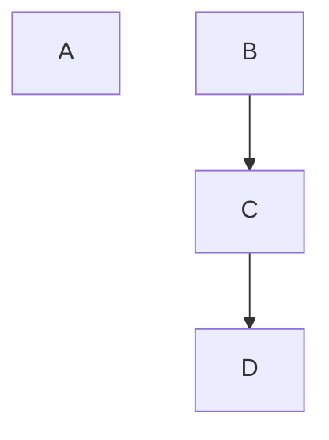
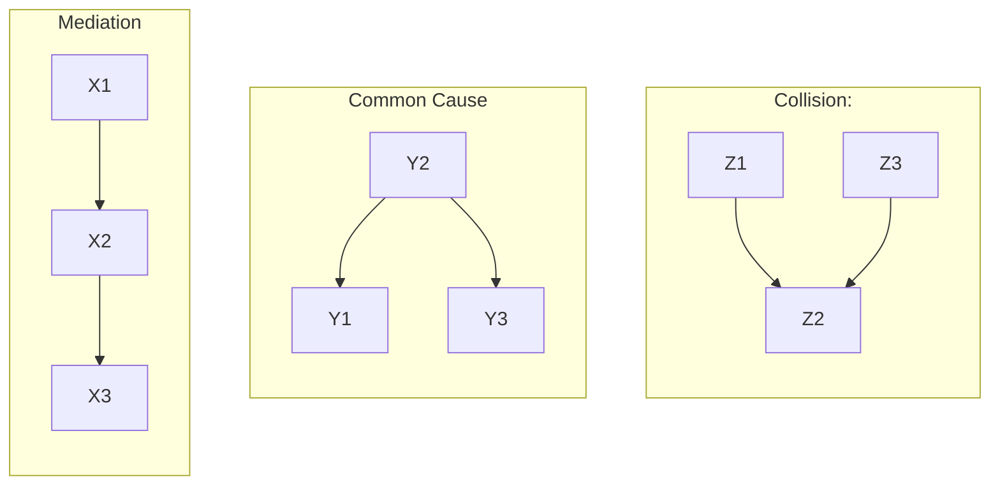

## What is a DAG?

The easiest way to represent information about the causal structure of a dataset is in the form of a DAG, or *directed acyclic graph*. The nodes in a DAG represent variables, and the directed edges represent causal effects. Nodes with solid borders represent observed observed, while nodes with dashed borders represent unobserved variables. DAGs are a good format used for representing causal assumptions because they are easy for both humans and computers to understand.

For example, in this graph $A$ has a causal effect on $B$, and $B$ has a causal effect on $C$. $B$ is unobserved.

Technically, a graph is only a DAG if it only has directed edges. However, it's common to use a relaxed definition that allows using undirected edges to represent unobserved confounding. Undirected edges are dashed and represent unobserved variables with directed connections to the two nodes.

So, we could also represent the above graph like this:

Here, the undirected edge represents the fact that $B$ will influence both $A$ and $C$; it is an unobserved [confounder](./Confounding.md).

:::info
The A in DAG stands for acyclic. Causal graphical models cannot contain "feedback loops", or cycles of directed edges. This is because, in causal graphical models, nodes do not represent values that can change in time. Instead, they are instantaneously determined as a function of their parents.
:::

## Relationship to Statistical Effects

A causal graph defines the way in which variables interact causally, but like any good model, it makes predictions for the kinds of correlations we can observe between variables. When we use a causal graph as a model of a system, we assume that the edges in the graph represent every way in which the variables influence each other. So, if two variables have no way to influence each other in the graph, then they will not have any statistically significant association.

Causal graphs, as models, encode predictions about what kind of conditional independence relations will hold between the variables.

Consider the following graph. In this graph, $B$ can influence $C$ directly, and it can also influence $D$ through $C$. So, this graph is consistent with worlds in which $B$ is associated with $C$ and $D$. However, in this graph, there is no way for $B$ to influence $A$ or vice versa. So, this graph is inconsistent with worlds in which these two variables are associated.

There are three ways in which nodes can influence each other in causal graphs: mediation, common cause, and collision. We will consider mediation and common cause first. In the example below, $X1$ is possibly correlated with $X3$, and $Y1$ is possibly correlated with $Y3$. This makes sense. Under mediation, $X1$ can influence $X2$ which can influence $X3$. When $Y2$ is a common cause of $Y1$ and $Y3$, it can cause them both to vary at the same time.

We can *block* the paths through $X2$ and $Y2$ by conditioning on them. So, in the case of mediation, even though $X1$ and $X3$ are possibly associated in the model, they are independent conditional on $X2$, ($X1 \perp\!\!\!\!\perp X3 | X2$). To make this intuitive, you can imagine that $X1$ is time spent studying for the SAT, $X2$ is SAT score, and $X3$ is whether the student was admitted to a given school. Spending more time studying for the SAT will increase SAT score, which will increase chance of admission. However, if we know the students SAT score, then learning more about how much time they spent studying for it won't change our opinion of how likely admission is.

Similarly, in the common cause example, conditioning on $Y2$ will make $Y1$ and $Y3$ independent. In this case, $Y1$ can represent whether someone plays the guitar, $Y2$ can represent whether they plays the piano, and $Y3$ can represent whether they are , and $Y2$ can represent whether it rained. If we learn that the sidewalk it wet, then this will make it very likely that the grass it also wet because it probably rained. However, if we know that it didn't rain, 

$$
Y1 \perp\!\!\!\!\perp Y3 | Y2
$$

## D-Separation

