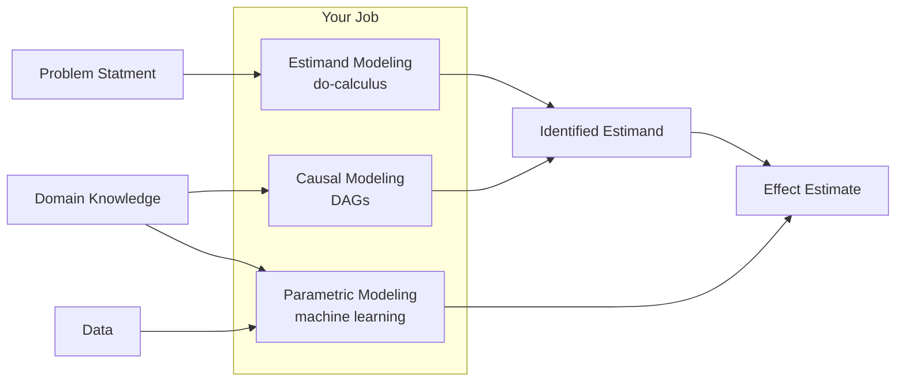

```mermaid
flowchart LR
    d["Data"]
    m["Domain Knowledge"]
    s["Problem Statment"]

    p["Parametric Modeling\nmachine learning"]
    c["Causal Modeling\nDAGs"]
    e["Estimand Modeling\ndo-calculus"]

    ie["Identified Estimand"]
    ce["Effect Estimate"]

    s --> e
    d --> p
    m --> c & p

    subgraph Your Job
        p;c;e
    end

    c & e --> ie
    ie & p --> ce
```