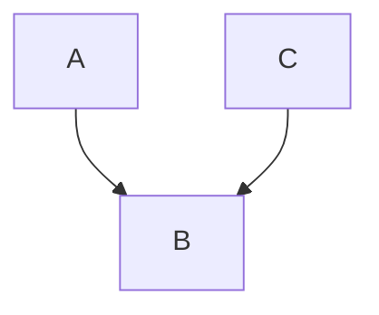

import DocLink from '@site/src/components/DocLink'

Colliders are nodes which have multiple parents in a causal graph. Colliders are interesting because they can cause counterintuitive behavior in the distribution $P(A,B,C)$. Conditioning on a collider can introduce statistical association between its parents.

This effect can create issues in an analysis if not accounted for (see <DocLink to="collider bias"/>). It can be exploited to infer information about the structure of a graph based on the distribution of its variables (see <DocLink to="causal discovery"/>).

## Example
Suppose the following is a causal graph:

In this example, $A$ and $C$ will be independent in their joint distribution $P(A,C)$, but dependent in the conditional distribution $P(A,B | C)$.